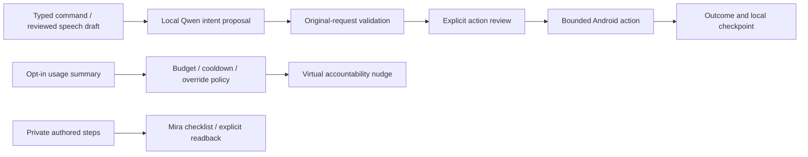

# FocusPilot · meet Mira

A private Android productivity companion: choose a task, keep a focus session,
and ask Mira for a short, reviewed phone action. Mira is an original animated goth
character with gentle reactions and mute, hide and reduce-motion controls.

**Qwen3.5-0.8B Q4_0 remains the local command model.** Earlier v0.12 Nothing-phone
tests establish CPU inference, typed commands, countdowns, paused recovery and task
readback. v0.13 adds reviewed session reset, verified through 22 isolated Android
checks with production state preserved. Visible reset cancellation, voice,
permissioned monitoring, iQOO NPU and Office Kit still need physical verification.

[Download research v0.13](https://github.com/sanjuhs/iqoo-focuspilot/releases/tag/research-v0.13)
· [Watch the 4:41 research demo](https://github.com/sanjuhs/iqoo-focuspilot/releases/download/research-v0.12/pitch-v012.mp4)
· [Build source](https://github.com/sanjuhs/iqoo-focuspilot/tree/research-v0.13)
· [Verified status](docs/status.md)

> **Pre-event research, not an eligible Finale submission.** The public iQOO
> guide requires competition code to be written during the event. Preparation
> prototypes live under `prototype/`; reuse needs explicit organizer approval.
> [Rules, tracks and full judging rubric](hackathon.md).

## Try the research app

The app supports Android 9/API 28+ on ARM64. Published v0.13 packages use an
optimized CPU library requiring **DOTPROD/I8MM/FP16**; it has been tested on
Nothing A059 / SM7635 / Android 16. For other hardware, build the generic variant
below. These are signed debug research packages, not a Play Store release.

| Download | Size | Model setup |
| --- | ---: | --- |
| [Bundled APK](https://github.com/sanjuhs/iqoo-focuspilot/releases/download/research-v0.12/focuspilot-research-v012-feedback-bundled.apk) | 568.54 MB | Includes the pinned 563.04 MB GGUF; first load verifies and imports it into private storage. Allow roughly 1.1 GiB plus installation staging space. |
| [Light APK](https://github.com/sanjuhs/iqoo-focuspilot/releases/download/research-v0.12/focuspilot-research-v012-feedback-light.apk) | 5.81 MB | Needs the developer model-preparation step below. |

Verify downloaded bytes against the [v0.12 SHA-256 manifest](docs/guidance-readback-artifacts.json).
The release tag identifies app source `24f10b62a4a62c22ad6db90ac6339f29e2426dbd`.
The selected bundled APK passed actual missing-model import and second-load reuse
on Nothing, with app data retained: **1,077 ms** import/SHA and **2,320 ms** CPU load.
Its first unconfirmed typed request took **9,534 ms**. The original model, light APK
and recorded app state were restored. Clean fresh-data installation remains a
separate test. [Current import proof](docs/bundled-import-phone-v012.md) ·
[Historical import proof](docs/bundled-model-evidence.json).

1. Install the compatible APK and open FocusPilot. Observation starts off.
2. Open **Ask Mira**, load the local model, and type `Start focus for 20 seconds`.
3. Choose **Understand command locally**, inspect the proposal, then review and confirm
   the action. Cancel leaves it unexecuted. Stop pauses; Start can resume the
   remaining countdown. Process recovery starts paused.
4. Save your own task and one to eight steps. Mark/Undo changes your checklist;
   **Speak** requests the current step and **Stop readback** cancels it.
5. Explore the clearly labelled policy and few-shot sandboxes with synthetic
   examples. The accountability balance is virtual; no money is withdrawn.

Use **Set up Mira** for optional microphone, notifications and Usage Access.
Enable those through Android only when you choose the associated feature.
Push-to-talk requires an installed on-device recognition language; recognition
creates an editable draft before inference and action review. Availability alone
is not a tested voice workflow. [Feature setup](docs/command-readiness.md).

Persistent mode is an opt-in, visible focus-monitor service with Stop controls.
Optional floating Mira has separate overlay permission and an explicit Show
review. Neither is a silent microphone or a guarantee of 24/7 survival through
Android/OEM process management. Actual monitoring, notification and floating
lifecycle checks remain pending. [Background contract](prototype/android/README.md)
· [Floating controls](docs/floating-companion.md).

## What is measured

Results below describe the named research builds and experiments. Small smoke
sets are not general automation accuracy or population latency benchmarks.

| Capability | Evidence and current boundary |
| --- | --- |
| Local command understanding | Qwen3.5-0.8B Q4_0 executes through pinned llama.cpp JNI in the Nothing app process; ARM CPU/KleidiAI I8MM is observed. Three supported v0.12 timer proposals took **1.824–1.928 s native inference**, excluding interaction time. [Phone record](docs/focus-recovery-phone.md). |
| Focus action and recovery | **Ten v0.12 phone phases passed**: reviewed Cancel/Start, early Pause, paused-time exclusion, resume, automatic completion and exact paused recovery after force-stop. Two countdowns added exactly 40,000 ms; final total 97,331 ms, observation off and 100 points. This is last-checkpoint recovery, not deep-sleep survival. [Procedure](docs/focus-recovery-phone.md). |
| Task guidance and speech | v0.12 save, mute refusal and explicit readback reached the installed offline-English TTS engine's completion callback; checklist state stayed unchanged. Speaker audibility and ASR remain unverified. Broader checklist/restart branches retain v0.11 attribution. [Readback](docs/guide-readback-phone.md) · [Checklist](docs/task-guide-phone.md). |
| Approved app launches | Historical v0.11 reviewed Calculator/Clock launches matched foreground metadata. No external UI was touched and no alarm was created. Alarm completion and general cross-app automation remain pending. [Launch evidence](docs/app-launch-phone.md). |
| Command reliability | The unchanged v0.10 gate/model combination accepted **31/50 supported** frozen synthetic host requests and rejected all 50 unsupported requests; **19 supported requests falsely abstained**. Raw intent correctness was 36/100. No universal safety or voice accuracy claim. [Selected evaluation](docs/conversational-commands.md) · [Rejected compact-output experiment](docs/compact-intent-research.md). |
| Activation viewer | Four finite width-1,024 tensor summaries are observed on phone, including v0.12 capture. Historical v0.11 paired timings establish no fixed capture overhead. Laptop interventions produced no positive semantic steering finding. [Capture comparison](docs/capture-benchmark-phone.md) · [Causal experiment](docs/interpretability-experiment.md). |
| Fast decision research | A separate **65-parameter positive-weight policy** scored 472/480 synthetic held-out cases versus 469/480 for a logistic baseline. It remains sandbox/shadow-only. Few-shot retrieval has abstentions; rejected LoRA and intent-head candidates are not deployed. [Policy](docs/policy-baselines.md) · [Learning limits](docs/live-preferences.md). |
| Build and packaging | Selected v0.12: **148 JVM tests**, zero lint errors/65 warnings, inspected model/native/license identities and no `INTERNET` permission. Fully disconnected operation, thermals and peak-memory measurement still need verification. [Artifact manifest](docs/guidance-readback-artifacts.json). |
| Phone export | v0.12 review/picker Cancel and actual local Save passed. A 496-byte empty summary matched phone/laptop checksums and passed zero-record schema validation. No policy inference or Office Kit transfer occurred. [Actual export](docs/phone-export.md). |
| Hardware, bridge and submission | Actual iQOO/NPU execution, Office Kit pairing/transfer, live permissioned monitoring, IoT hardware, accepted application and eligible event submission remain unfinished. Local laptop export validation is separate from Office Kit. [Remaining deliverables](docs/remaining-deliverables.md). |

The [4:41 video](docs/v012-pitch.md) combines original Mira animation with two
actual own-app clips at 1× speed: authored-step readback and unconfirmed typed
Qwen inference (1,849 ms native CPU). Other scenes are labelled illustrations.
Caption timing, full decode and sampled encoded visuals passed; complete human
listening remains pending. The later recovery test is not in that recording.
Historical release results and videos remain in [status](docs/status.md) and
[previous releases](https://github.com/sanjuhs/iqoo-focuspilot/releases).

## How it works



The language model proposes an intent. Independent code validates the complete
original request, arguments and permissions before execution. Repeated focus
nudges use a hand-set policy; the trained tiny network evaluates explanations in
a separate sandbox/shadow path. It cannot create live actions. Authored steps are
inert private text, excluded from model input and exports.

The larger goal includes voice-controlled assistance, few-shot personalization,
a useful fast decision path, scoped phone automation, activation experiments and
an actual iQOO/laptop bridge. [Architecture](docs/architecture.md) and
[the delivery plan](plan.md) preserve those requirements and their acceptance gates.
An ADB cable is development access, not Office Kit integration; local CPU inference
is not Snapdragon NPU evidence.

## Build from source

Use Java 17, Android SDK platform 36, NDK 28.2, Gradle 8.14, Node.js and Python 3.
Set `ANDROID_HOME` to your SDK. The build script fetches the pinned llama.cpp
source into ignored `research/`, builds JNI, and runs Android tests, assembly and
lint. [Detailed Android setup](prototype/android/README.md)
· [Model pin and runtime](docs/on-device-model.md).

```sh
git clone https://github.com/sanjuhs/iqoo-focuspilot.git
cd iqoo-focuspilot
git checkout research-v0.12

# Download and verify the selected model into ignored local storage.
node prototype/qwen/prepare-model.mjs qwen35

# Generic ARM64 CPU build with bundled model.
./scripts/build_android.sh -PbundleLocalModel=true

# Inspect authorized USB debugging; unlock and accept RSA on the phone yourself.
python3 scripts/check_device.py --serial YOUR_DEVICE_SERIAL
adb -s YOUR_DEVICE_SERIAL install -r prototype/android/app/build/outputs/apk/debug/app-debug.apk
```

For a light build, omit `-PbundleLocalModel=true`, install it, then run
`python3 scripts/prepare_phone.py --serial YOUR_DEVICE_SERIAL --skip-install`. That preparation
checks hashes and transfers the pinned model into the debug app's private storage.
Use `NATIVE_BUILD_VARIANT=optimized` only after verifying the required CPU features.
The generic build is portable to supported ARM64 CPUs; it is not byte-identical
to the published optimized APK.

No provider API key is required by the Android runtime. Keep total project,
dependencies, models and generated artifacts under **15,000,000,000 bytes**;
aim below 10 GB. Avoid redundant model/runtime copies. Model weights and private
captures stay outside Git; only explicitly sanitized research media is published.

## Documentation and research

| Start with | Purpose |
| --- | --- |
| [instructions.md](instructions.md) · [plan.md](plan.md) | Working rules, implementation sequence and acceptance gates |
| [hackathon.md](hackathon.md) · [event research](docs/hackathon-research.md) | Productivity track, 100% rubric, event-written code and application requirements |
| [Verified status](docs/status.md) · [remaining deliverables](docs/remaining-deliverables.md) | Current proof, historical attribution and full unfinished scope |
| [Architecture](docs/architecture.md) · [model research](docs/model-research.md) | Android design, Kev/Laya/CUA research, licenses and model comparisons |
| [Companion design](docs/companion-design.md) · [voice](docs/voice-integration.md) | Original Mira artwork, accessibility controls and speech lifecycle |
| [Task guide](docs/task-guide.md) · [timed focus](docs/timed-focus.md) | Authored steps, review/cancellation, countdown and recovery contracts |
| [Data export](docs/data-export.md) · [phone proof](docs/phone-export.md) · [laptop review](docs/officekit-export-workflow.md) | Private export schema and bounded local replay; Office Kit proof gates |
| [Tiny policy](docs/policy-baselines.md) · [fine-tuning](docs/qwen-finetuning.md) · [intent head](docs/intent-head.md) | Measured research, rejected candidates and synthetic limitations |
| [Task-planning research](docs/task-draft-research.md) · [sandbox automation](docs/sandbox-automation.md) | Unpromoted planning experiments and two own-app selector controls |
| [Snapdragon deployment](docs/snapdragon-deployment.md) · [activation experiments](docs/interpretability-experiment.md) | Actual-backend and causal-evidence requirements |
| [Current pitch](docs/v012-pitch.md) · [editable narration](docs/v012-research-pitch-script.md) | Video, captions, exact evidence and reproducible rendering |

## Contribute

Original project code and documentation are [MIT licensed](LICENSE). Model,
runtime and dependency licenses remain their own; immutable pins and notices are
in [model research](docs/model-research.md). Check upstream redistribution terms,
including mixed-license CUA components, before copying code or weights.

Use synthetic or consented sandbox content. Keep `.env`, credentials, weights,
training data and private phone captures ignored. Optional cloud development tools
must not become a hidden dependency of the local runtime. Real payments,
purchases, messages and destructive actions require action-level confirmation;
the current accountability balance is simulated.

Before a push, inspect the Git index and named changes:

```sh
python3 scripts/check_secrets.py
git status --short
```

The checker avoids printing credentials but cannot recognize every secret format.
Keep measured limitations with new evidence in [docs/status.md](docs/status.md).
