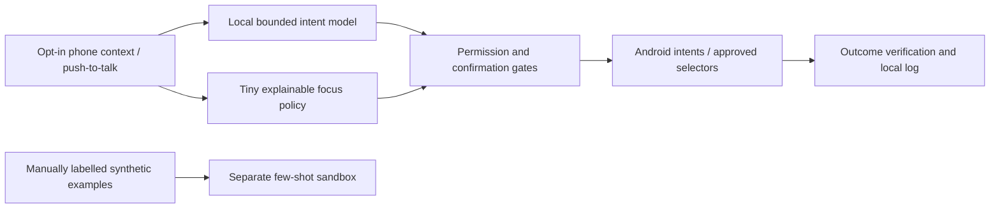

# FocusPilot

A phone-first productivity assistant designed for local, fast, explainable decisions.
Working research prototype for the iQOO Grand Finale, Productivity track.

## Selected v0.12 task readback

Mira now keeps speech feedback and Stop readback beside Speak, with unique request
ownership, engine callbacks and a 20-second timeout. The selected source is
`24f10b62a4a62c22ad6db90ac6339f29e2426dbd`; 148 JVM tests pass and lint has
zero errors/65 warnings. Both signed packages passed model/native/license/version/
permission inspection, and the light installation reused the pinned Qwen model.

On Nothing, a synthetic authored plan passed save, mute refusal, explicit readback
completion callback and an unconfirmed typed Qwen Pause proposal (1,749 ms native
CPU). Checklist progress stayed unchanged. Cleanup restored empty goal/no guide/
mute false; paused/off/100/57,331 ms and runtime grants stayed unchanged.
[Actual record and repeat procedure](docs/guide-readback-phone.md),
[package/source identities](docs/guidance-readback-artifacts.json).
No speaker audibility, real ASR, permissioned monitoring/floating, disconnected
operation, iQOO NPU, Office Kit or eligible accepted submission is established.
The broader goal remains active. Earlier results below retain their historical
package attribution.

Both APKs, the package manifest and physical record are
[published as research v0.12](https://github.com/sanjuhs/iqoo-focuspilot/releases/tag/research-v0.12).
The server's four sizes/digests and exact source tag were verified;
[publication record](docs/guidance-publication-v012.json).

**Historical v0.11 phone-control check:** typed Qwen proposals for Calculator and Clock
passed review/Cancel/review/Confirm and opened the approved target apps, verified
through foreground metadata. Native inference was about 2.0 s. Focus/grants stayed
unchanged; no external-app UI was inspected and no alarm was created.
[Actual launch coverage](docs/app-launch-phone.md).

**Historical v0.11 Qwen3.5 activation check:** eight unconfirmed typed phone proposals
preserved the same Pause intent and token counts. Every capture-on run displayed
all four selected tensor summaries; capture-off displayed none. Native timing
ranged 1.86–2.17 s, and post-request PSS was about 1.25 GiB. Four pairs do not
establish capture overhead or causal interpretation. [Measurements](docs/capture-benchmark-phone.md).

**Historical v0.11 phone readback:** reviewed typed Pause (1,804 ms native CPU) reached the
installed offline-English TTS engine's completion callback. Audibility, actual ASR
and disconnected operation remain unverified. Monitoring correctly refused an
observation-off start; focus stayed paused/off/100 with unchanged elapsed time.
[Physical coverage](docs/readback-phone.md). The latest setup check still reports
Microphone, notifications and Usage Access off.

**Historical task-guide build: v0.11**, source `e8691e0a17f53d7d1ed0eebc2bd7bebb4a10bd4a`.
Mira can show the next step of your own private plan, mark it complete, undo and
optionally read it through the existing local voice path. Task/record revision
checks block stale progress and readback; authored text executes nothing.
**143 JVM tests pass**, lint zero errors/65 warnings. Signed light APK inspected
and installed with matching APK/model hashes; paused/off/100 points unchanged.
A later authored-guide phone test passed Save, Mark/Undo, complete/Undo, process
restart recovery, replacement Cancel/confirm and clear Cancel/confirm/restart.
Its temporary goal and steps were cleaned up; focus stayed paused/off/100 and
elapsed time unchanged. [Authored-guide evidence](docs/task-guide-phone.md).
That record did not cover readback; the later v0.12 check covers a separate branch. A later own-app phone countdown
passed: reviewed 20-second start, automatic pause, exactly 20,000 ms additional
elapsed focus and unchanged observation-off/100 points. One typed CPU inference
took 1,932 ms. [Physical evidence](docs/current-countdown-phone-v011.json),
[preserved failed test](docs/countdown-first-attempt-v011.json). Qwen3.5-0.8B Q4_0,
prompt, command gate and native CPU library are unchanged.
[Task guide and physical checks](docs/task-guide.md). Both signed packages inspected;
[v0.11 is published](https://github.com/sanjuhs/iqoo-focuspilot/releases/tag/research-v0.11); both APKs and both evidence files match server
sizes/SHA-256 digests, and its tag resolves to the exact app source.
[Artifact identities](docs/task-guide-artifacts.json).

The new [simpler-policy comparison](docs/policy-baselines.md) reports 469/480 for
two seven-parameter logistic models versus 472/480 for the unchanged network.
These informed synthetic results promote neither model to monitoring.

**Previous command research build: v0.10**, source `bcc24733655e4eced67d68ff5c47f7ab97d60b36`.
Qwen3.5-0.8B Q4_0, its original prompt and native CPU runtime are unchanged.
The reviewed command gate now accepts explicitly listed greetings and polite
wrappers while consuming the complete request and preserving exact tool arguments.
On 100 fresh frozen synthetic requests, correct supported proposals rose
**15→31/50**, with 16 gains/zero losses, all 50 unsupported requests rejected and
zero wrong accepts observed. **19 supported requests still abstain**. Raw model
intent correctness is only 36/100; the external gate rejects its 49 unsupported
non-unknown proposals. This is host evidence, not ASR, autonomy or phone accuracy.
[Contract, prompt rejection and limits](docs/conversational-commands.md).

**133 JVM tests pass**; lint zero errors/62 warnings. Both signed APKs passed
model/native/license/permission inspection. Light installed with matching APK and
retained private-model identities; paused focus, observation off, 100 virtual points
and permissions were unchanged. At that installation the phone was asleep; the later v0.11 countdown above
supplies one current typed case. Voice and floating proof remain pending. Optional movable Mira retains
reviewed Show and Open/Pause focus/Hide controls; screen-off/lock/revocation ends
floating mode. [Companion proof gates](docs/floating-companion.md),
[full remaining deliverables](docs/remaining-deliverables.md).

Historical v0.8 tested 12/40 supported proposals versus 9/40, with 28 false
abstentions and nine gains/six regressions. Preserve that experiment separately;
its different sample cannot establish v0.10's gain.

**New System 1 research:** a separate classifier trained on actual frozen Qwen
activations scored 76/90 raw intents versus 46/90 for generation on the same
synthetic held-out set. Its validation-selected abstention uses brittle numerical
saturation, and the frozen v0.7 action gate yields 15/65 correct supported commands
versus 17/65 for generation. It remains research-only; APK/model weights are
unchanged. [Results and limits](docs/intent-head.md).

**Previous verified phone-action build: v0.6**, source `29c4c3372fcc913d3672e59803a3aa870fa2426b`.
Set up Mira shows optional feature readiness; typed local-model Start/Pause were
reviewed, confirmed and checked on Nothing. The app was left paused with usage off
and 100 virtual points. A wrongly proposed alarm cancellation was rejected.
[Command readiness](docs/command-readiness.md) and [58-case host reliability](docs/command-reliability.md)
record the limits: 25/58 raw intent correctness, 49/58 gated correctness including
abstentions, 16/23 supported commands correct, and two accepted mismatches.
The [laptop export reviewer](docs/officekit-export-workflow.md) performs local CPU
shadow replay; Java-export/Python-consumer interoperability is verified with
synthetic data, without an Office Kit transfer. Physical ASR, Office Kit and NPU
execution remain pending.

[Current research APKs](https://github.com/sanjuhs/iqoo-focuspilot/releases/tag/research-v0.12)
are published; previous builds remain preserved. A new [4:35 current Mira research pitch](docs/current-pitch.md)
reflects v0.10 with original animations, measured captions and source-bound figures.
[Video, captions and manifests are backed up with v0.10](https://github.com/sanjuhs/iqoo-focuspilot/releases/tag/research-v0.10);
complete human listening and a recorded current phone demonstration remain pending.
The [4:53 baseline pitch and captions](https://github.com/sanjuhs/iqoo-focuspilot/releases/tag/research-v0.3)
remain preserved in 0.3. The bundled APK includes Qwen; the light APK needs
model preparation. Both currently use an optimized ARM64 CPU library verified on
Nothing A059, requiring DOTPROD/I8MM/FP16. Use the generic source build on other
ARM64 devices.

> **Pre-event research repository.** Public rules require event-written competition
> code. Preparation prototypes are dated and kept under `prototype/`; this repository
> does not establish that they can be reused in the competition submission.

The goal is a private assistant that understands a short command, notices when a
user's chosen distraction budget is exceeded, explains its nudge and helps complete
a task. Android native actions provide a reliable starting point; broader screen
automation follows permission and sandbox testing. The penalty balance is virtual.

## Task-planning experiments — unpromoted

Actual local-model host planning failed useful-task criteria: the first candidate
served 0/8 benign goals; the example-based repair fully met 4/10 fresh benign
criteria and included nonsense/negation failures. Both experiments and a compiled
but unapplied reviewed-import scaffold are preserved. At that experiment, the v0.11 app,
model, prompt and native remained unchanged. [Evidence](docs/task-draft-research.md).

## Start here

| Document | Purpose |
| --- | --- |
| [instructions.md](instructions.md) | Working instructions, setup, privacy and verification |
| [plan.md](plan.md) | Milestones, implementation sequence and storage budget |
| [hackathon.md](hackathon.md) | Full rubric, tracks, eligibility and submission checklist |
| [docs/status.md](docs/status.md) | What is verified and what remains |
| [docs/architecture.md](docs/architecture.md) | Android/model/action design |
| [docs/model-research.md](docs/model-research.md) | Kev, Laya, CUA, licenses and small-model options |
| [docs/hackathon-research.md](docs/hackathon-research.md) | Sourced event research |
| [docs/demo-script.md](docs/demo-script.md) | Pitch and demo preparation |
| [docs/current-pitch.md](docs/current-pitch.md) | Current 4:35 pitch, reproducible narration/animation and evidence |
| [docs/research-pitch-script.md](docs/research-pitch-script.md) | Historical v0.3 pitch narration |
| [docs/task-guide.md](docs/task-guide.md) | Private authored steps, completion/undo and readback |
| [docs/policy-baselines.md](docs/policy-baselines.md) | Logistic comparison and synthetic limitations |
| [docs/companion-design.md](docs/companion-design.md) | Mira artwork, motion and persistent-mode design |
| [docs/floating-companion.md](docs/floating-companion.md) | Optional floating controls and actual device proof gates |
| [docs/voice-integration.md](docs/voice-integration.md) | Local speech drafts and lifecycle gates |
| [docs/live-policy-evidence.md](docs/live-policy-evidence.md) | Measured-input mapping and shadow explanations |
| [docs/intent-head.md](docs/intent-head.md) | Trained representation classifier, same-set comparison and deployment limits |
| [docs/qwen-finetuning.md](docs/qwen-finetuning.md) | Actual local QLoRA experiment and rejected candidate |
| [docs/live-preferences.md](docs/live-preferences.md) | Private labels from complete real summaries |
| [docs/sandbox-automation.md](docs/sandbox-automation.md) | Five-second own-app selector proof |
| [docs/data-export.md](docs/data-export.md) | User-selected private summary export |
| [docs/conversational-commands.md](docs/conversational-commands.md) | Fresh gate-only confirmation and rejected prompt experiments |
| [docs/remaining-deliverables.md](docs/remaining-deliverables.md) | Full outstanding scope and physical/account gates |
| [docs/natural-commands.md](docs/natural-commands.md) | Whole-request forms, English slots and frozen comparison |
| [docs/timed-focus.md](docs/timed-focus.md) | Countdown semantics, regression fixes and pending phone checks |
| [docs/command-readiness.md](docs/command-readiness.md) | Setup screen and confirmed typed phone actions |
| [docs/command-reliability.md](docs/command-reliability.md) | Frozen host command results and accepted failures |
| [docs/officekit-export-workflow.md](docs/officekit-export-workflow.md) | Implemented laptop review; actual Office Kit pending |
| [docs/completion-audit.md](docs/completion-audit.md) | Artifact audit and remaining completion gates |
| [docs/snapdragon-deployment.md](docs/snapdragon-deployment.md) | Isolated GenieX readiness and required device proof |

## Design



Quantized **Qwen3.5-0.8B Q4_0 runs inside the Android app** through a pinned llama.cpp
CPU bridge. The model proposes a bounded intent; independent code validates the
original request and asks for confirmation. Actual activation summaries are visible
in the model lab. Laya is a laptop comparison. The [activation experiment](docs/interpretability-experiment.md)
defines controlled causal tests; observing tensors alone does not establish their meaning.
Recurring nudges use a hand-set policy; a separate 65-parameter trained sandbox
shows hidden-unit contributions and interventions. New source also evaluates that
network in a shadow panel against consented usage summaries when all inputs are
known; its uncalibrated score changes no actions. User-declared task/time targets
stay private. Push-to-talk can create editable command drafts through an installed
on-device speech service, followed by manual inference and action review. Physical
voice and full usage-permission tests are still pending. Mira is an original animated
goth companion with mute, hide and reduce-motion controls. Snapdragon NPU execution
and Office Kit remain unverified.
An ADB connection is a development tool, not Office Kit integration.

## Device check

Requires Android SDK Platform Tools and Python 3.

```sh
python3 scripts/check_device.py
# If multiple phones are connected:
python3 scripts/check_device.py --serial YOUR_DEVICE_SERIAL
```

Unlock the phone and accept the USB debugging RSA prompt. The script reads device
properties without capturing screens or granting app permissions. Verified development
device: Nothing A059, Android 16/API 36, `SM7635`, `arm64-v8a`.

See [Android research app](prototype/android/README.md) and
[selected-model deployment](docs/on-device-model.md) for build/run instructions.

```sh
node prototype/qwen/prepare-model.mjs qwen35
./scripts/build_android.sh
python3 scripts/prepare_phone.py --serial YOUR_DEVICE_SERIAL
```

For a standalone research APK that contains Qwen, use
`./scripts/build_android.sh -PbundleLocalModel=true` (generic ARM64) or add
`NATIVE_BUILD_VARIANT=optimized` only on supported DOTPROD/I8MM/FP16 hardware.
The bundled APK imported and verified its own model on the phone, then generated
without ADB model preparation. The light/bundled artifacts are documented in
[research artifact evidence](docs/research-artifacts.json).

Downloaded weights and generated native libraries/APKs remain ignored; the preparation
script checks the model hash and streams it into debug app-private storage.

## Contribution and attribution

Original project code/documentation is MIT licensed. Upstream model, runtime and
dependency licenses remain their own. Research sources and immutable checkout pins
are listed in [model research](docs/model-research.md). No upstream implementation
has been copied into the initial project. Do not describe mixed-license CUA components
as uniformly MIT, and do not redistribute weights without verifying their license.

Use synthetic or consented sandbox content. Keep downloaded weights, private data,
captures and local `.env` files ignored. Optional cloud development tooling must not
be a dependency of the claimed offline runtime or contain keys in the APK.

```sh
python3 scripts/check_secrets.py
git status --short
```

The secret checker scans the Git index without printing credentials. It is a helpful
pre-push check, not a guarantee that every possible secret format is recognized.

## Milestone status

Research, device authorization and real phone CPU inference are verified. One cold
request took 19.9 seconds; a subsequent request with tensor capture took 4.1 seconds
on Nothing A059. These are two smoke observations, not p50/p95 or iQOO measurements.
The optimized ARM CPU lab later ran warm requests around 1.65–1.72 seconds and
verified I8MM kernel selection. Two unsafe requests were rejected by the external
validator despite model misclassification. A local few-shot label sandbox is
implemented with honest abstention/coverage reporting. The Android app has no
INTERNET permission. Broader phone tests,
NPU/Office Kit verification and final video remain work in progress; consult
[verified status](docs/status.md) for current evidence. A public repo is a backup,
not a completed hackathon application or submission.
