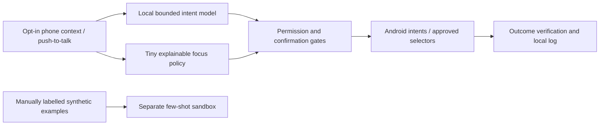

# FocusPilot

A phone-first productivity assistant designed for local, fast, explainable decisions.
Working research prototype for the iQOO Grand Finale, Productivity track.

[Current research APKs](https://github.com/sanjuhs/iqoo-focuspilot/releases/tag/research-v0.4)
are backed up as a prerelease. The [4:53 baseline pitch and captions](https://github.com/sanjuhs/iqoo-focuspilot/releases/tag/research-v0.3)
remain preserved in 0.3. The bundled APK includes Qwen; the light APK needs
model preparation. Both currently use an optimized ARM64 CPU library verified on
Nothing A059, requiring DOTPROD/I8MM/FP16. Use the generic source build on other
ARM64 devices.

> **Pre-event research repository.** Public rules require event-written competition
> code. Preparation prototypes are dated and kept under `prototype/`; this repository
> does not establish that they can be reused in the competition submission.

The goal is a private assistant that understands a short command, notices when a
user's chosen distraction budget is exceeded, explains its nudge and helps complete
a task. Android native actions provide a reliable starting point; broader screen
automation follows permission and sandbox testing. The penalty balance is virtual.

## Start here

| Document | Purpose |
| --- | --- |
| [instructions.md](instructions.md) | Working instructions, setup, privacy and verification |
| [plan.md](plan.md) | Milestones, implementation sequence and storage budget |
| [hackathon.md](hackathon.md) | Full rubric, tracks, eligibility and submission checklist |
| [docs/status.md](docs/status.md) | What is verified and what remains |
| [docs/architecture.md](docs/architecture.md) | Android/model/action design |
| [docs/model-research.md](docs/model-research.md) | Kev, Laya, CUA, licenses and small-model options |
| [docs/hackathon-research.md](docs/hackathon-research.md) | Sourced event research |
| [docs/demo-script.md](docs/demo-script.md) | Pitch and demo preparation |
| [docs/research-pitch-script.md](docs/research-pitch-script.md) | Editable narration for the rendered research pitch |
| [docs/companion-design.md](docs/companion-design.md) | Mira artwork, motion and persistent-mode design |
| [docs/voice-integration.md](docs/voice-integration.md) | Local speech drafts and lifecycle gates |
| [docs/live-policy-evidence.md](docs/live-policy-evidence.md) | Measured-input mapping and shadow explanations |
| [docs/snapdragon-deployment.md](docs/snapdragon-deployment.md) | Isolated GenieX readiness and required device proof |

## Design



Quantized **Qwen3.5-0.8B Q4_0 runs inside the Android app** through a pinned llama.cpp
CPU bridge. The model proposes a bounded intent; independent code validates the
original request and asks for confirmation. Actual activation summaries are visible
in the model lab. Laya is a laptop comparison. The [activation experiment](docs/interpretability-experiment.md)
defines controlled causal tests; observing tensors alone does not establish their meaning.
Recurring nudges use a hand-set policy; a separate 65-parameter trained sandbox
shows hidden-unit contributions and interventions. New source also evaluates that
network in a shadow panel against consented usage summaries when all inputs are
known; its uncalibrated score changes no actions. User-declared task/time targets
stay private. Push-to-talk can create editable command drafts through an installed
on-device speech service, followed by manual inference and action review. Physical
voice and full usage-permission tests are still pending. Mira is an original animated
goth companion with mute, hide and reduce-motion controls. Snapdragon NPU execution
and Office Kit remain unverified.
An ADB connection is a development tool, not Office Kit integration.

## Device check

Requires Android SDK Platform Tools and Python 3.

```sh
python3 scripts/check_device.py
# If multiple phones are connected:
python3 scripts/check_device.py --serial YOUR_DEVICE_SERIAL
```

Unlock the phone and accept the USB debugging RSA prompt. The script reads device
properties without capturing screens or granting app permissions. Verified development
device: Nothing A059, Android 16/API 36, `SM7635`, `arm64-v8a`.

See [Android research app](prototype/android/README.md) and
[selected-model deployment](docs/on-device-model.md) for build/run instructions.

```sh
node prototype/qwen/prepare-model.mjs qwen35
./scripts/build_android.sh
python3 scripts/prepare_phone.py --serial YOUR_DEVICE_SERIAL
```

For a standalone research APK that contains Qwen, use
`./scripts/build_android.sh -PbundleLocalModel=true` (generic ARM64) or add
`NATIVE_BUILD_VARIANT=optimized` only on supported DOTPROD/I8MM/FP16 hardware.
The bundled APK imported and verified its own model on the phone, then generated
without ADB model preparation. The light/bundled artifacts are documented in
[research artifact evidence](docs/research-artifacts.json).

Downloaded weights and generated native libraries/APKs remain ignored; the preparation
script checks the model hash and streams it into debug app-private storage.

## Contribution and attribution

Original project code/documentation is MIT licensed. Upstream model, runtime and
dependency licenses remain their own. Research sources and immutable checkout pins
are listed in [model research](docs/model-research.md). No upstream implementation
has been copied into the initial project. Do not describe mixed-license CUA components
as uniformly MIT, and do not redistribute weights without verifying their license.

Use synthetic or consented sandbox content. Keep downloaded weights, private data,
captures and local `.env` files ignored. Optional cloud development tooling must not
be a dependency of the claimed offline runtime or contain keys in the APK.

```sh
python3 scripts/check_secrets.py
git status --short
```

The secret checker scans the Git index without printing credentials. It is a helpful
pre-push check, not a guarantee that every possible secret format is recognized.

## Milestone status

Research, device authorization and real phone CPU inference are verified. One cold
request took 19.9 seconds; a subsequent request with tensor capture took 4.1 seconds
on Nothing A059. These are two smoke observations, not p50/p95 or iQOO measurements.
The optimized ARM CPU lab later ran warm requests around 1.65–1.72 seconds and
verified I8MM kernel selection. Two unsafe requests were rejected by the external
validator despite model misclassification. A local few-shot label sandbox is
implemented with honest abstention/coverage reporting. The Android app has no
INTERNET permission. Broader phone tests,
NPU/Office Kit verification and final video remain work in progress; consult
[verified status](docs/status.md) for current evidence. A public repo is a backup,
not a completed hackathon application or submission.
