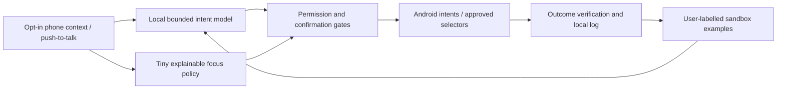

# FocusPilot

A phone-first productivity assistant designed for local, fast, explainable decisions.
Working concept for the iQOO Grand Finale, Productivity track.

> **Pre-event research repository.** Public rules require event-written competition
> code. Preparation prototypes are dated and kept under `prototype/`; this repository
> does not establish that they can be reused in the competition submission.

The goal is a private assistant that understands a short command, notices when a
user's chosen distraction budget is exceeded, explains its nudge and helps complete
a task. Android native actions provide a reliable starting point; broader screen
automation follows permission and sandbox testing. The penalty balance is virtual.

## Start here

| Document | Purpose |
| --- | --- |
| [instructions.md](instructions.md) | Working instructions, setup, privacy and verification |
| [plan.md](plan.md) | Milestones, implementation sequence and storage budget |
| [hackathon.md](hackathon.md) | Full rubric, tracks, eligibility and submission checklist |
| [docs/status.md](docs/status.md) | What is verified and what remains |
| [docs/architecture.md](docs/architecture.md) | Android/model/action design |
| [docs/model-research.md](docs/model-research.md) | Kev, Laya, CUA, licenses and small-model options |
| [docs/hackathon-research.md](docs/hackathon-research.md) | Sourced event research |
| [docs/demo-script.md](docs/demo-script.md) | Pitch and demo preparation |

## Design



Quantized Qwen3.5-0.8B Q4_0 is the selected command-understanding candidate;
Laya's 322M/421M models are a decision-model comparison. Neither is an established
Android deployment here yet. The [activation experiment](docs/interpretability-experiment.md)
defines the causal tests for the command-model inspector. The research prototype starts with deterministic
commands and a transparent hand-set scorer; it visibly reports that no LLM is
installed. CPU/GPU local inference and Snapdragon NPU execution are separately tested.
An ADB connection is a development tool, not Office Kit integration.

## Device check

Requires Android SDK Platform Tools and Python 3.

```sh
python3 scripts/check_device.py
# If multiple phones are connected:
python3 scripts/check_device.py --serial YOUR_DEVICE_SERIAL
```

Unlock the phone and accept the USB debugging RSA prompt. The script reads device
properties without capturing screens or granting app permissions. Verified development
device: Nothing A059, Android 16/API 36, `SM7635`, `arm64-v8a`.

See the prototype's own README for build/run instructions as it becomes available.

## Contribution and attribution

Original project code/documentation is MIT licensed. Upstream model, runtime and
dependency licenses remain their own. Research sources and immutable checkout pins
are listed in [model research](docs/model-research.md). No upstream implementation
has been copied into the initial project. Do not describe mixed-license CUA components
as uniformly MIT, and do not redistribute weights without verifying their license.

Use synthetic or consented sandbox content. Keep downloaded weights, private data,
captures and local `.env` files ignored. Optional cloud development tooling must not
be a dependency of the claimed offline runtime or contain keys in the APK.

```sh
python3 scripts/check_secrets.py
git status --short
```

The secret checker scans the Git index without printing credentials. It is a helpful
pre-push check, not a guarantee that every possible secret format is recognized.

## Milestone status

Research and device authorization are complete. App/model prototypes, learning,
NPU/Office Kit verification and final video remain work in progress; consult
[verified status](docs/status.md) for current evidence. A public repo is a backup,
not a completed hackathon application or submission.
