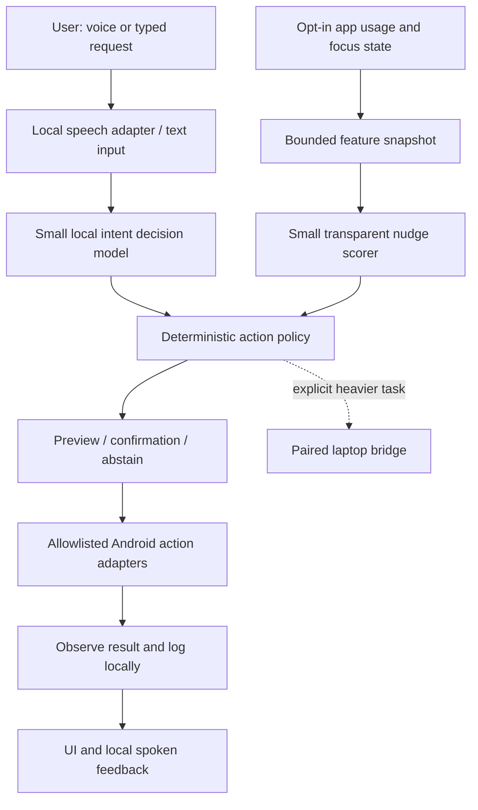

# Local productivity assistant: build specification

Prepared 2 October 2026, Asia/Kolkata. **Status: proposed architecture; completion claims belong in the verification record.** The early 3 October target is preparation/application material; the public Grand Finale is 9–11 October. An experimental pre-event laboratory prototype may be developed under `prototype/android` and clearly dated. It is not event-created code or an eligible submission. Reconcile the signed-in dashboard and event code-window rule before implementing competition code. See [hackathon.md](../hackathon.md), [instructions.md](../instructions.md), [plan.md](../plan.md), and [status.md](status.md) for the controlling scope and verification record.

## Product and track

Build a voice-operated Android assistant that helps the owner follow a focus plan, recognizes a small set of requested tasks, and explains every nudge. The main track is **Productivity**. A working smart-light integration could support Smart Living later; it should not displace the core phone demo. A transparent decision inspector is a technical-depth feature, rather than a separate Developer Tools submission. The assistant's accountability balance is simulated: “5 focus credits deducted” or “₹5 simulated” clearly labeled on every relevant screen. There is no real payment integration in the MVP.

The strongest demonstrable loop is: start a focus session → observe an opted-in distracting app → show why a nudge was selected → offer a break or return to work → follow a voice request to open the phone's alarm screen. The user chooses which apps are distracting; Instagram can also be work. App identity alone does not establish intent, attention, or whether an activity is productive.

## Proposed components

Use native Kotlin and Jetpack Compose for the eventual Android app. Keep the first release to one app, one local database, and one selected model/runtime combination. A public cloud backend is unnecessary for the local core. The “full stack” can be the Android client, on-device inference, local persistence, and an optional paired laptop worker.

| Component | Responsibility | MVP boundary |
| --- | --- | --- |
| Home / focus UI | Session timer, opted-in apps, live backend label, push-to-talk, pause, erase history | No hidden observation or permanent microphone |
| Observation adapter | UsageStats totals and a bounded snapshot; optional Accessibility events for assistive interaction | No continuous screenshots, passwords, notification contents, or arbitrary app text collection |
| Local model adapter | Map a command and small context to a fixed intent with probabilities | Model output cannot directly execute a gesture or invent tools |
| Slot parser | Extract validated time, duration, and allowed app name | Ambiguous “seven” prompts for clarification; no guessed time |
| Positive nudge scorer | Compute an inspectable focus-risk score from explicit features | Separate small neural model; does not explain all transformer activations |
| Action policy | Check current permission, consent, confidence, state freshness, cooldown, and adapter availability | A policy failure always abstains, regardless of model confidence |
| Action adapters | Alarm/timer intents, start/end focus, return home on request, open allowlisted app | Payments, purchases, messages, file deletion, and arbitrary autonomous navigation excluded |
| Local store | Goals, coarse usage aggregates, simulated balance, decision traces, model manifest | App-private data; opt-out and erase controls; personal data excluded from Git |
| Laptop worker | Optional heavier planning and opt-in example training | Offline core still works without it; execution location visible |

## Android capability contract

**Observation.** `UsageStatsManager` offers app usage history and requires `PACKAGE_USAGE_STATS` access for cross-app queries. The owner must grant usage access in Settings. It does not provide a complete screen recording or a guaranteed immediate callback for every user action. Handle denied/revoked access, locked-user null results, event gaps, reboot, and multi-window ambiguities without fabricating usage. For the initial build, collect reports on app resume and during an explicitly active, supported focus session. A proposed across-app monitor needs its service lifecycle and current platform requirements verified on the actual phone before promising continuous operation. [Android UsageStatsManager](https://developer.android.com/reference/android/app/usage/UsageStatsManager)

**Assistive control.** A user-enabled `AccessibilityService` can receive configured events, inspect exposed UI nodes, and perform supported actions. Use it only for an explicit assistive voice/control feature; filter packages and event types, prefer semantic node actions, and provide an obvious stop control. Custom-drawn screens, unavailable nodes, secure screens, OEM changes, and lock screens are capability failures, not invitations to retry blindly. Automation stays user-directed and allowlisted. Review distribution requirements before any Play release. [Android accessibility-service guide](https://developer.android.com/guide/topics/ui/accessibility/service), [AccessibilityService API](https://developer.android.com/reference/android/accessibilityservice/AccessibilityService)

**Voice.** Start with push-to-talk while the app is visible and request microphone permission at that moment. On API 31+, check `isOnDeviceRecognitionAvailable` before selecting `createOnDeviceSpeechRecognizer`; additionally check/test language support. The default recognition implementation can use remote services, so never silently substitute it in a local-only mode. If offline recognition is unavailable, offer typed input or select and validate a separately bundled offline recognizer. Test spoken output with installed local TTS voices in airplane mode too. Android explicitly restricts starting microphone foreground services from the background. Always-listening wake-word support is a later feature with its own battery and lifecycle work. [SpeechRecognizer API](https://developer.android.com/reference/android/speech/SpeechRecognizer), [microphone foreground-service requirements](https://developer.android.com/develop/background-work/services/fgs/service-types#microphone)

**Alarm and timer.** Prefer `AlarmClock.ACTION_SET_ALARM` and `ACTION_SET_TIMER`, request the appropriate `SET_ALARM` permission, and verify a receiving app exists. Keep the receiving clock UI visible for the demo. An intent launch is an action attempt; show the created alarm/timer before reporting success. Using the system clock avoids designing a custom exact-alarm scheduler for the MVP. A time-of-day intent does not express an arbitrary calendar date: constrain the first demo to a clear clock time or duration. [AlarmClock API](https://developer.android.com/reference/android/provider/AlarmClock)

**Background work.** Do not assume an ordinary application can keep a general-purpose infinite monitoring loop alive. Select the legitimate foreground-service type and permissions only after its actual function is known; account for user-visible notification, system start restrictions, and OEM battery behavior. A paused or stopped monitor must say so. [Android foreground-service types](https://developer.android.com/develop/background-work/services/fgs/service-types)

ADB is a development/testing channel. A demonstration performed by laptop-driven `adb input` is not proof that the installed Android assistant controls the phone independently.

## System 1 decisions and model selection

The initial fixed intent set is `START_FOCUS`, `END_FOCUS`, `SET_ALARM`, `SET_TIMER`, `OPEN_APP`, `EXPLAIN_NUDGE`, and `UNKNOWN`. Slots are validated independently. A command such as “Set an alarm for 7:30 AM” selects `SET_ALARM`; the parser supplies hour 7 and minute 30. “Set it for seven” must clarify. Adding an intent requires an action adapter and held-out examples, rather than allowing arbitrary generated tool names. Following the user's updated direction, use the selected quantized Qwen3.5-0.8B Q4_0 first with a closed command schema and an instrumented llama.cpp CPU baseline. Keep Laya as a bounded-decision comparison; long planning remains outside the first inference port. The command-model activation inspector follows [interpretability-experiment.md](interpretability-experiment.md) and is separate from tiny-policy explanations.

Decision confidence is useful only after domain evaluation. A provisional threshold such as 0.85 is a hypothesis, not a safety guarantee. Measure calibration and tune an abstention threshold against held-out phone commands; invalid/missing slots and unavailable permissions always stop execution. Record the state snapshot version and expire action previews if the screen or requested task changes.

| Candidate | Why consider it | Port/runtime gate |
| --- | --- | --- |
| Laya 322M multilingual / 421M English decision model | Both fit the requested parameter range; native typed-decision output is aligned with intent selection | Select one variant and verify its model card, license, tokenizer, graph and Android runtime before adoption |
| Qwen2.5-0.5B-based constrained intent model | Within the requested approximate 0.1–0.5B scale; local baseline and small supervised intent head | Select a verified Android-compatible export/runtime; preserve tokenizer and compare predictions after quantization |
| Kev-0.5B prototype | Direct choice/yes-no/score distributions; a research starting point for System 1 routing | Prototype is superseded; adapter plus custom pointer head and attention-mask behavior require a faithful port. A generic GGUF chat runner is not a Kev port |

Sources: [Qwen2.5-0.5B model card](https://huggingface.co/Qwen/Qwen2.5-0.5B), [Kev-0.5B upstream model card](https://github.com/jaredpalmer/kev/blob/main/docs/model-cards/kev-0.5b.md), [Laya English model card](https://huggingface.co/convaiinnovations/laya), [Laya multilingual model card](https://huggingface.co/convaiinnovations/laya-multilingual), and [Laya upstream README](https://github.com/receptron/laya). Laya's existing Node.js package is not an Android library. Its ONNX export is a starting artifact, not verified phone/NPU support. Upstream performance is not our phone performance. Review [repository research](model-research.md) before adoption.

Use Cua as inspiration for an observe → decide → act → verify loop and sandbox evaluation. The Android adapter must obey Android capabilities; the desktop Cua stack cannot simply be packaged as a phone app. [Cua repository](https://github.com/trycua/cua)

Set an initial context limit of 256–512 tokens and one decision per request. Keep model identity, revision, checksum, license, quantization, runtime version, and active execution provider in a manifest. At 4 bits, 500 million parameters need roughly 250 MB for raw weights; at 8 bits, roughly 500 MB. These arithmetic estimates exclude tokenizer, scales, graph overhead, activations, buffers, and runtime memory. Measure the installed bundle and peak RSS instead of quoting raw weights as total memory.

## Positive tiny network and honest interpretability

Use a separate monotone model to explain **whether to offer a focus nudge**. Do not attempt to turn the whole pretrained language model into a positive network in the hackathon window.

Specify six normalized, nonnegative risk features: selected-app budget overrun, continuous-session overrun, reopen count, active-focus overlap, repeated deferred nudges, and elapsed-time overrun. Each feature's definition and clipping range are visible. A one-hidden-layer model can use 6 inputs → 8 hidden units → 1 output, with nonnegative connection weights and signed biases: 48 input weights + 8 hidden biases + 8 output weights + 1 output bias = **65 parameters**. One suitable constraint is `W = softplus(V)` during training. ReLU hidden activations and a sigmoid output preserve monotonicity of the score with respect to those risk features.

Signed biases allow a useful baseline and threshold. Requiring every weight and bias to be positive would prevent the intended low-risk baseline in this design. Monotonicity encodes a product assumption, not correctness: the scorer must never infer moral failure or debit real money. User-designated work sessions, permission loss, stale observations, cooldowns, and pause are deterministic gates outside the network.

The inspector should show feature values, hidden activations, output score, threshold, policy gate, and outcome. For each feature, rerun the model with that feature set to zero and show the score change; label it an ablation, since nonlinear effects do not generally add up. Show direct output contributions to the pre-sigmoid logit separately. Claims of causal understanding require controlled interventions and held-out behavior. This offers transparent analysis of a 65-parameter scorer, not mechanistic interpretation of every circuit in the LLM.

Training proposal: collect owner-labeled sandbox sessions, train on laptop, compare a hand-authored rule baseline, and export the tiny network for phone inference. If no training has occurred, label weights “hand-authored demonstration parameters,” never “learned.” Test monotonicity by increasing one feature at a time; test false nudges, duplicate-event idempotency, cooldown, pause, and missing-data cases.

## Sandbox, examples, and fine-tuning

Create a toy environment in the event window with a fake feed, a clock action fixture, and a focus dashboard. Record only consented toy tasks. Use state summaries rather than arbitrary screenshots: app category, focus state, elapsed/budget values, command text, candidate actions, correct action, expected result, and reason for abstention. Keep all personal recordings outside Git.

Separate three claims:

1. **Few-shot prompting:** supply a few example state/action pairs to an unchanged model.
2. **Supervised adaptation:** actually update the intent head or LoRA weights from labeled examples, then evaluate a saved checkpoint.
3. **Few-shot personalization:** use a small owner's sample to adapt and test on independent sessions. Memorizing replayed training examples is not generalization.

Begin with 10–20 varied command examples per supported intent plus ambiguous, unrelated, and malicious screen-text cases. Split by paraphrase/template and session so nearly identical examples cannot land in both training and evaluation. Keep a frozen held-out set; report command intent accuracy, valid-slot rate, UNKNOWN precision/recall, action success, calibration, p50/p95 latency, model-load time, memory, and thermal behavior. Synthetic examples and tiny sample metrics must be labeled as such. Defer LoRA unless the baseline and deployment path already pass.

## Local laptop / Office Kit bridge

Core observation, decision, nudge, and alarm tasks remain on the phone. The optional local worker can train a small adapter, provide a longer plan, or run a sandbox tool. Pair via a user-approved short-lived secret, use an authenticated connection, allowlist requests, and expose an explicit “Send this task to my laptop” action. Send redacted task summaries only. Disconnecting the laptop must leave the local core usable.

Office Kit is an event-provided bridge whose actual SDK/interface must be obtained from organizers. A generic USB, LAN, or ADB connection is not proof of Office Kit usage. Record official bridge initialization and a successful task trace before claiming its rubric contribution. Confirm both dependencies and local data route; use no cloud fallback without visible consent.

## Runtime and Snapdragon NPU proof gates

Android NNAPI is deprecated; it should not be the default new-runtime strategy. Candidate acceleration paths are LiteRT with a supported Qualcomm delegate or ONNX Runtime with the QNN HTP backend. Each requires compatible hardware, libraries, graph operators, and quantization. A model being ONNX, a phone being Snapdragon, or a successful inference does not prove NPU execution. [Android NNAPI migration guide](https://developer.android.com/ndk/guides/neuralnetworks/migration-guide), [LiteRT NPU overview](https://developers.google.com/edge/litert/android/npu/overview), [ONNX Runtime QNN provider](https://onnxruntime.ai/docs/execution-providers/QNN-ExecutionProvider.html)

| Gate | Required evidence | Label if unproven |
| --- | --- | --- |
| Device | Actual device model, SoC, API level, arm64 ABI, runtime/backend support | “Device compatibility pending” |
| Native model port | Fixed examples have equivalent outputs before/after export; quantify quantization drift | “Model port pending” |
| Phone inference | Installed APK runs checksummed model in airplane mode with laptop disconnected | “Laptop prototype” or “Phone CPU inference” as measured |
| NPU | Runtime logs/profiler show QNN HTP/vendor accelerator assignment for the actual model graph; list CPU-fallback nodes and timing | “NPU unverified”; tiny scorer NPU does not imply LLM NPU |
| Performance | Warm/cold runs, 30+ fixed cases, p50/p95 inference and end-to-end times, memory and temperature | “Target only” |
| Control | Phone app invokes its native action adapter and resulting alarm/focus state is visibly verified | “Action attempt” until verified |
| Office Kit | Actual official bridge setup and task execution trace | “Local bridge proposal” |
| Training / explanation | Saved checkpoint, split/seed, held-out results, interventions and limitations | “Planned experiment” |

The development device has been verified separately as Nothing A059, Android 16/API 36, SM7635, arm64. That establishes an Android testing target, not target-iQOO or Office Kit compatibility. Keep the signed-in/event phone identity separate in the evidence manifest; use [status.md](status.md) for the latest actual measurements.

Initial targets, to be measured: tiny scorer under 10 ms; local intent decision p95 under 500 ms on the event phone; typed command to action preview under 1 second; speech latency reported separately. Failure to meet these is information for scoping, not a reason to invent numbers. Timebox the first NPU integration attempt to 4 hours during the event; preserve an honest CPU fallback and separate the NPU-backed component in the demo if only the tiny scorer can be accelerated.

## Build order and scope cuts

Before the event, finish research, signed-in eligibility checks, device/tool diagnostics, design, example schemas, and the concept/application video outline. An explicitly labeled laboratory prototype under `prototype/android` can test UX and device APIs as pre-existing research, with its real creation date preserved. Do not build or relabel competition runtime code under the public event-window restriction until eligibility is clarified. The first lab baseline should visibly say “No LLM: hand-authored rules” until phone model inference is independently verified.

During the authorized event window:

1. **First 6 hours:** native UI, explicit consent, focus state, simulated ledger, and system-clock intent flow; verify independently on phone.
2. **Next 6 hours:** one local model/runtime, typed commands, abstention, trace inspector, airplane-mode proof.
3. **Next 8 hours:** UsageStats integration, user-directed assistive controls, push-to-talk only if offline support is verified; permission-revocation and cooldown tests.
4. **Next 8 hours:** tiny scorer training/inspection, one NPU experiment, official Office Kit integration if documentation/device access exists.
5. **Final reserve:** repeatable demo, evidence bundle, open-source hygiene, pitch, video export, submission checks.

Cut first: IoT, always-listening audio, general screen agent, broad task planning, real payments, and transformer-wide interpretation. If the smallest model cannot be deployed, retain a clearly labeled rules demo and report the failed gate; it must not be marketed as the completed on-device LLM solution.
